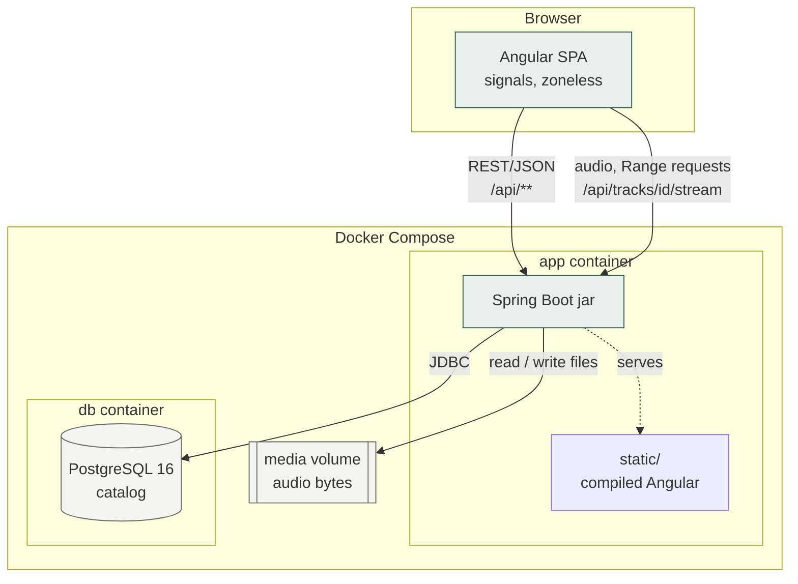
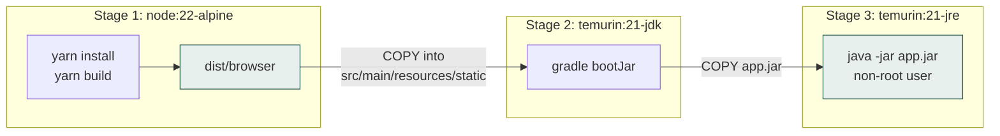
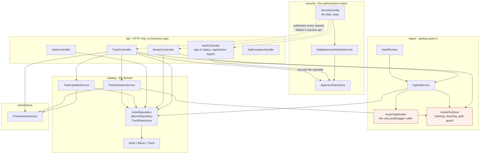
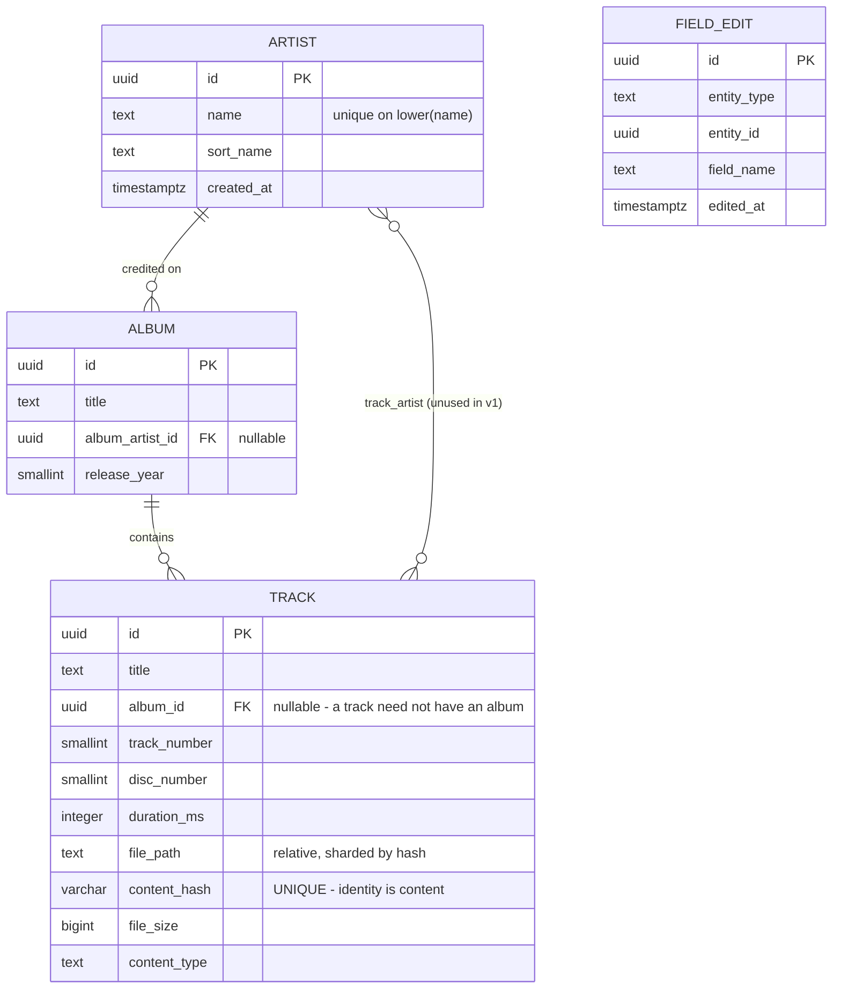
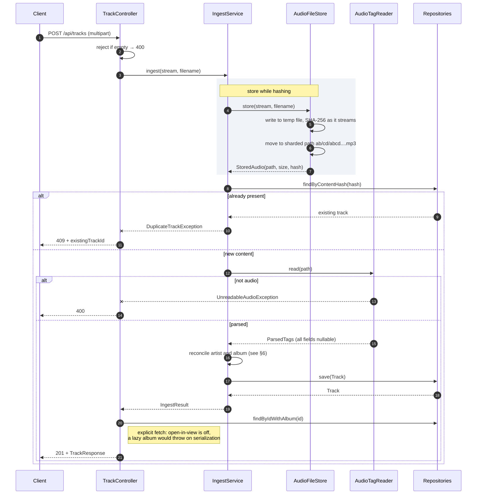
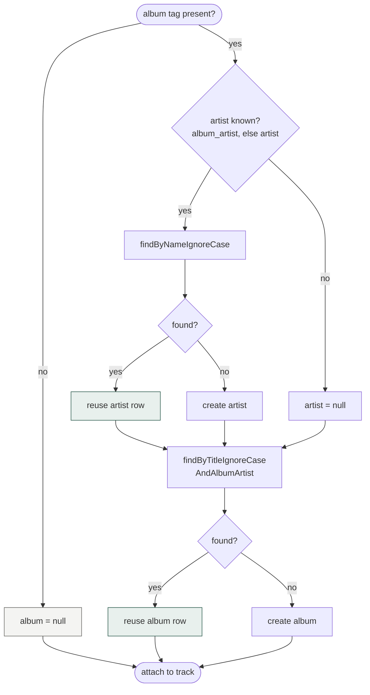
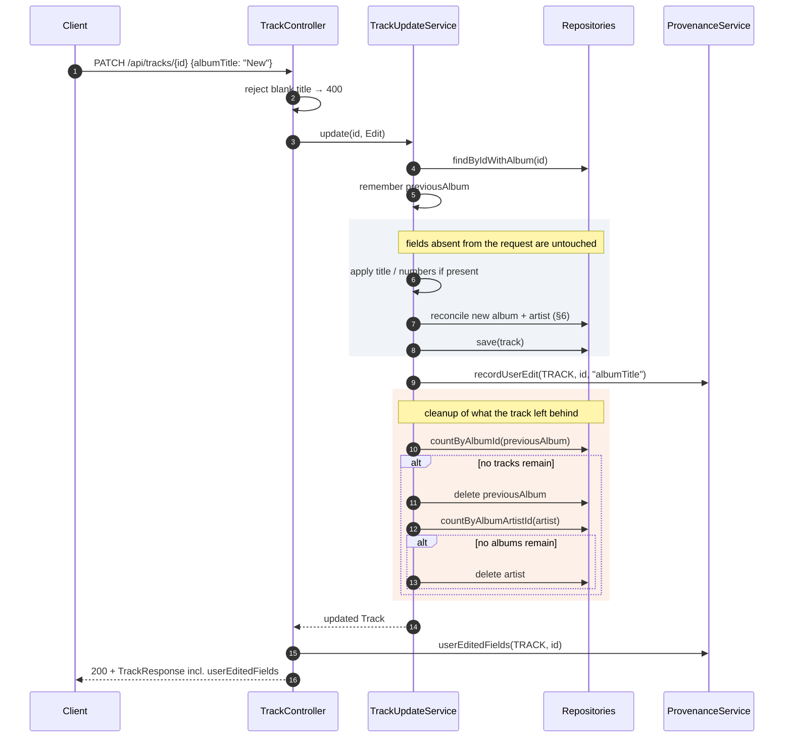
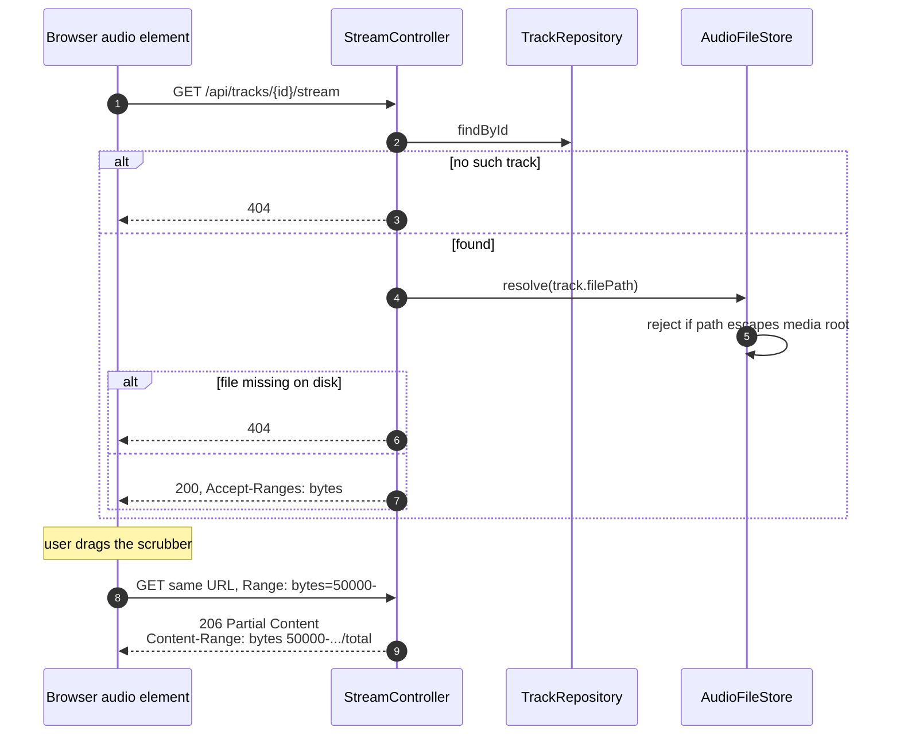
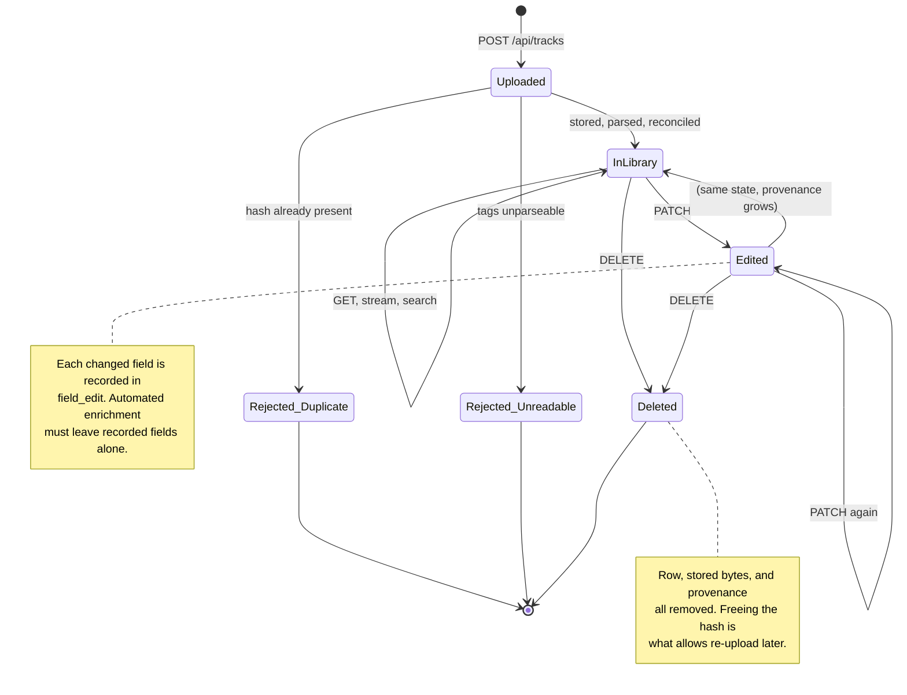
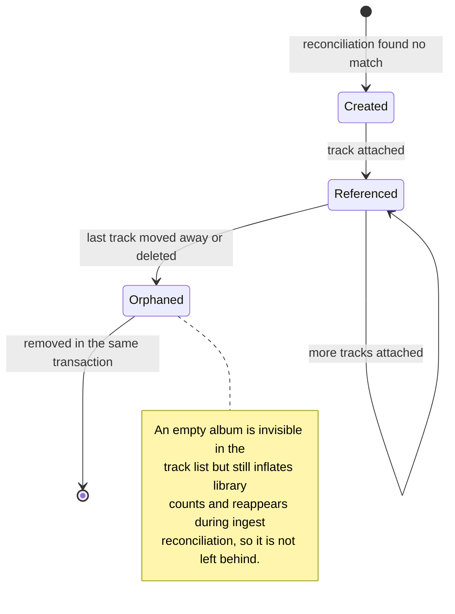

# Architecture

Diagrams of what this system is and how its parts actually interact. Each one is here because it
shows a mechanism that is hard to see from the code alone; none are decoration.

Rendered by GitHub directly. For the reasoning behind these shapes, see [DECISIONS.md](DECISIONS.md).

---

## 1. Deployment: what runs

Two containers and one command. The frontend is not separately served: it is compiled into the
backend jar as static resources, which is why there is no web server to configure and why the
reproducibility requirement is satisfiable at all.

**Why the audio is on a volume and not in the database.** Audio files are large and are served with
range requests. Streaming them out of Postgres would mean pulling bytes through JDBC on every seek.
The database holds the catalog; the filesystem holds the bytes; a track row points at a path.

---

## 2. Build pipeline

The multi-stage build is what makes "one command on a stranger's machine" true. Note that tests are
deliberately *not* run inside the image build.

Tests need Docker themselves, via Testcontainers, and running Docker inside a Docker build is a
complication with no payoff. They run on the host instead.

---

## 3. Backend components

Grouped by responsibility rather than by technical layer, so that files which change together live
together. Arrows are dependency direction.

The two highlighted classes are the isolation boundaries that matter:

- **`AudioTagReader`** is the only place jaudiotagger appears. It is unmaintained (3.0.1, 2021), so
  confining it means replacing it touches one file and its test.
- **`AudioFileStore`** is the only place a user-influenced value reaches the filesystem. Its
  `resolve()` rejects paths escaping the media root, because `StreamController` serves whatever it
  returns and path traversal would otherwise be an arbitrary file read.

`catalog` knows nothing about HTTP or files. `api` holds no logic, so the wire format can change
without disturbing the domain.

**`security`** holds the whole authorization boundary in one place: `SecurityConfig` is the URL
matrix (who may reach what), and it is deliberately not method-level annotations scattered across
`ingest` and `catalog`, because `SeedRunner` ingests the bundled tracks at boot with no
authenticated user present. See D15.

---

## 4. Data model

Three things in this model are load-bearing:

1. **`album_id` is nullable.** A track with no album is legitimate, which is why every track query
   must use left joins. JPQL path navigation compiles to an inner join and silently drops these rows.
2. **`content_hash` is unique.** Identity is content, not filename. This makes duplicate upload a
   constraint violation and makes seeding idempotent for free.
3. **`field_edit` is keyed per field**, not per track, so correcting a title does not mark the whole
   track as untouchable by future enrichment.

`track_artist` exists but is unmapped in v1. Per-track credits are needed first by richer metadata
editing; the table is there so adding them is not a migration against live data.

---

## 5. Ingest: upload to library entry

The most involved flow in the system, and the one where order matters. Bytes are stored *before*
tags are parsed, because the hash is needed to detect a duplicate and the tag reader wants a real
file on disk.

Step 5 is where a temp file is used rather than writing straight to the final path: the destination
name is derived from the hash, which is not known until all the bytes have been read, and a partial
upload must never occupy a real path.

The note on the last step records a bug that actually happened. Re-fetching with a plain `findById`
and then serializing the album threw `LazyInitializationException`, returning 500 for an upload that
had already committed. The track appeared in the library while the UI reported failure.

---

## 6. Artist and album reconciliation

This is the decision that makes a library rather than a list of files. It runs on every ingest and
on every edit that touches album or artist.

Two subtleties encoded here:

- **An album is matched on title *and* credited artist**, not title alone. Many unrelated albums are
  called *Greatest Hits*.
- **A missing album tag yields no album, not an "Unknown Album" row.** An Unknown Album would
  collect every untagged track in the library into one grouping that looks real but means nothing.

---

## 7. Metadata edit: re-point, not rename

The subtlest behaviour in the system. Editing a track's album moves *that track*; it does not rename
the album for everyone. The old album is then cleaned up only if nothing is left on it.

An empty string for `albumTitle` or `artistName` means *detach*, not *set to blank*. That is how a
track ends up with no album through the API, and it takes the same cleanup path.

---

## 8. Playback and seeking

Short, but the reason it works is worth showing. Returning a `Resource` rather than writing bytes by
hand is what makes range handling correct.

Without `Accept-Ranges`, the browser plays from the start but the scrubber does nothing, which is
the kind of half-working that is worse than an absent feature.

**Not shown above, and worth stating explicitly: every request to this endpoint requires an
authenticated session.** The browser's audio element cannot attach an `Authorization` header to
the `Range` requests it issues on its own, so authentication happens once, at sign-in, via HTTP
Basic, and the resulting security context is persisted to an HTTP session
(`HttpSessionSecurityContextRepository`, configured explicitly in `SecurityConfig`). The session
cookie is what authenticates every request in the sequence above, including the ranged one the
browser sends unprompted while the user drags the scrubber. See D16 for why, and
`SessionAuthenticationTest.theSessionAloneAuthenticatesTheAudioRequest` for the regression guard.

---

## 9. Track lifecycle

---

## 10. Album and artist lifecycle

Albums and artists are never created or deleted directly. They come into existence through
reconciliation and disappear when nothing references them, which is why the same cleanup routine
appears in both editing and deletion.

