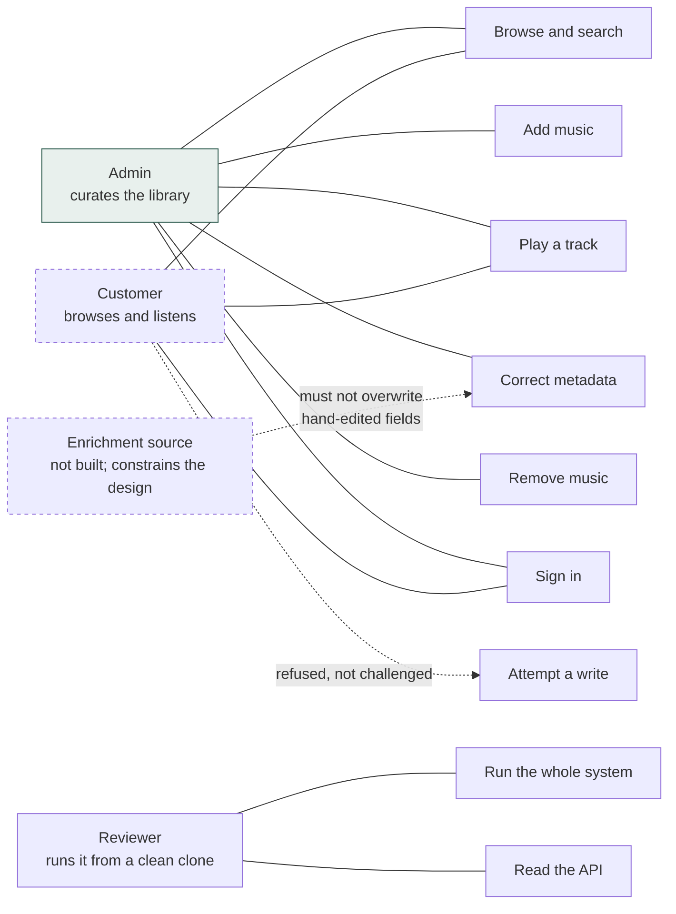

# Use Cases

What the system does, from the point of view of someone using it, and where each behaviour was
decided. Every case listed as **Built** has an automated test behind it; the test is named.

Cross-references: `Q*` are questions in [QUESTIONS.md](QUESTIONS.md), `D*` are decisions in
[DECISIONS.md](DECISIONS.md).

---

## Actors

There are two human actors now, an admin and a customer, plus two that impose constraints on the
design without being people at all.

The enrichment source is dashed because it does not exist yet. It is drawn because per-field
provenance exists *for* it, and a reader who does not know that will think the provenance table is
pointless. The customer is dashed for a different reason: everything a customer can do, an admin
can also do, so the customer is a *restriction* of the admin rather than an independent actor.

---

## UC-1 · Browse and search the library

**Built.** `GET /api/tracks` — `TrackControllerTest.listReturnsAPageWithTotalCount`,
`listFiltersByQueryAcrossTitleAlbumAndArtist`, `listIncludesTracksThatHaveNoAlbum`.

The owner opens the app and sees every track with its artist, album, track number and length. One
search box narrows by track title, album title, or artist name at once.

| | |
|---|---|
| **Main flow** | Open library → tracks listed alphabetically → type in search → list narrows after a 250 ms debounce |
| **Empty library** | An explicit empty state, not a blank page |
| **No matches** | "Nothing matches *term*", so it is clear the search ran |
| **Tracks with no album** | Still listed, album shown as an em dash |
| **Guarantee** | Page size clamped to 200; an unbounded request cannot pull the whole library |

The album-less case is the one worth calling out. It is a genuine class of row (D5), and an inner
join would drop it silently, so it has a dedicated regression test.

---

## UC-2 · Add music to the library

**Built.** `POST /api/tracks` — `TrackControllerTest.uploadReturnsCreatedWithTheAlbumAndArtistResolved`,
`uploadingTheSameBytesTwiceIsAConflictNotAServerError`, `uploadingSomethingThatIsNotAudioIsABadRequest`.

The owner picks an audio file. Its embedded tags are read and reconciled against the library, so a
second track from an album they already own joins that album rather than creating a duplicate one.

| Path | Result |
|---|---|
| **Main** | 201, track appears in the list without a reload |
| **Same bytes, any filename** | 409 with the id of the track that already holds them (D3, D4) |
| **Not audio** | 400 with a readable message |
| **No title tag** | Falls back to the filename rather than showing "Unknown" |
| **No album tag** | Track has no album; no "Unknown Album" bucket is invented (D5) |
| **Over the size limit** | 413 |

Deriving from Q5: the library ships populated with six tracks, so the app is useful the moment it
starts rather than demanding setup first.

---

## UC-3 · Play a track

**Built.** `GET /api/tracks/{id}/stream` — `StreamControllerTest`, 4 cases:
`servesTheWholeFileWithTheRightContentType`, `honoursARangeRequestSoTheBrowserCanSeek`,
`servesARangeFromTheMiddleOfTheFile`, `returnsNotFoundForAnUnknownTrack`.

The owner presses play. Audio streams from the library and the scrubber works, including dragging to
an arbitrary position.

| | |
|---|---|
| **Main flow** | Press play → row highlights → player bar shows the title → audio plays |
| **Seeking** | Range request returns 206 with a correct `Content-Range` |
| **Track deleted mid-playback** | Player clears rather than continuing against a dead URL |
| **Bytes missing from storage** | 404, distinct from "no such track" |

Answering Q4: real playback, not a simulated transport. A moving progress bar with no audio would
have taken an afternoon and proved nothing.

---

## UC-4 · Correct metadata

**Built.** `PATCH /api/tracks/{id}` — `TrackEditTest`, 11 cases.

The owner fixes a misspelled title, moves a track to the right album, or supplies a missing year.

| Path | Result | Test |
|---|---|---|
| **Edit a title** | Saved; other fields untouched | `editsTheTitle`, `omittedFieldsAreLeftAlone` |
| **Change the album** | Track *moves*; it is not a global rename (D-repoint) | `changingTheAlbumMovesTheTrackAndCleansUpTheAlbumItLeft` |
| **Old album now empty** | Removed, and its artist too if nothing else credits them | same |
| **Old album still has tracks** | Left alone | `movingOneOfTwoTracksLeavesTheOriginalAlbumInPlace` |
| **Change the artist** | Album re-attaches under the new artist | `changingTheArtistReattachesTheAlbumUnderTheNewArtist` |
| **Two tracks, same new artist** | One artist row, not two | `twoTracksEditedToTheSameArtistShareOneArtistRow` |
| **Empty album string** | Detaches; track has no album | `clearingTheAlbumWithAnEmptyStringLeavesTheTrackWithNoAlbum` |
| **Blank title / negative track number** | 400 | `aBlankTitleIsRejected`, `anImpossibleTrackNumberIsRejected` |

**Every edited field is recorded** (`editsAreRecordedAsProvenanceSoEnrichmentCannotOverwriteThem`).
The response carries `userEditedFields`, and the edit dialog marks those fields. This answers Q15
and D10: provenance is per field, so correcting a title does not make the whole track immune to a
future correction of its cover art.

**Edits change the library only.** Tags inside the audio files are never rewritten, and the dialog
says so rather than letting the owner assume otherwise. The trade-off is Q13.

---

## UC-5 · Remove music

**Built.** `DELETE /api/tracks/{id}` — `TrackDeletionTest`, 5 cases.

| Path | Result | Test |
|---|---|---|
| **Delete a track** | Gone from the library, 204 | `deletingATrackRemovesItFromTheLibrary` |
| **Last track of an album** | Album and its artist removed too | `deletingTheLastTrackOfAnAlbumRemovesTheAlbumAndItsArtist` |
| **One of several** | Album untouched | `deletingOneOfTwoTracksLeavesTheAlbumIntact` |
| **Stored bytes** | Deleted, so the same file can be uploaded again | `deletingRemovesTheStoredAudioSoTheSameFileCanBeUploadedAgain` |
| **Unknown id** | 404 | `deletingSomethingThatIsNotThereIsANotFound` |

Deletion is permanent and there is no undo, so the interface requires an inline confirmation. The
controls are permanently visible: an earlier version revealed them on row hover, which made them
undiscoverable and read as a missing feature rather than a tidy interface.

---

## UC-9 · Sign in, or create an account

**Built.** `GET /api/auth/me` with HTTP Basic —
`AuthenticationTest.theSeededAdminCanSignIn`, `theSeededCustomerCanSignIn`,
`theWrongPasswordIsUnauthorized`, `anUnknownUserIsUnauthorizedAndIndistinguishableFromABadPassword`.
`POST /api/auth/register` — `RegistrationTest`, 9 cases.

| | |
|---|---|
| **Main flow** | Enter username and password → app calls `/api/auth/me` with those credentials → a session is established and everything afterward, including audio requests the browser makes on its own, authenticates through it |
| **No account yet** | The sign-in screen's *Create an account* link registers, then immediately signs in with the same credentials |
| **A registered account is always a customer** | Nothing in the registration form or the request it sends can ask for anything else — `anAttemptToSupplyARoleIsIgnoredNotHonoured` posts a role anyway and asserts it made no difference |
| **A taken username** | 409, whether it collides with another registration or with a seeded account |
| **Wrong password, or unknown user** | 401, with the same message either way — a wrong password must not reveal whether the username exists |
| **No credentials at all** | 401 with no `WWW-Authenticate` challenge, so the browser's own credential dialog never appears; the app owns the login screen |
| **An existing session on reload** | Same endpoint, called with no header, decides whether to show the login screen or the library |

Answering the brief's request for two user types: authentication establishes *who*; UC-10 covers
what each *may do*. An admin account is never created this way — see D17.

## UC-10 · A customer is refused a write

**Built.** `AuthorizationMatrixTest`, 8 cases covering upload, edit, and delete as both roles.

| Path | Result | Test |
|---|---|---|
| **Customer attempts to upload** | 403, and nothing is added to the library | `aCustomerCannotUpload`, `aRefusedUploadDoesNotReachTheLibrary` |
| **Customer attempts to edit metadata** | 403 | `aCustomerCannotEditMetadata` |
| **Customer attempts to delete a track** | 403 | `aCustomerCannotDeleteATrack` |
| **Admin performs the same actions** | Succeeds | `anAdminCanEditMetadata`, `anAdminCanDeleteATrack` |
| **An admin's mutating request with no CSRF token** | 403 | `aMutatingRequestWithoutACsrfTokenIsRejected` |

403, not 401: the customer is genuinely signed in and was refused a specific action, which is a
different thing from not being signed in at all (UC-9). Collapsing the two would bounce a customer
who clicked something they should not see back to a login screen they are already past.

## UC-8 · Storage integrity (non-functional)

**Built.** `AudioFileStoreTest`, 8 cases. Not a user-facing use case, but it is where the system's
guarantees about identity and safety actually live.

| Guarantee | Why it matters | Test |
|---|---|---|
| **Identical bytes hash identically regardless of filename** | This is what makes duplicate detection work at all (D3) | `identicalBytesProduceTheSameHashRegardlessOfFilename` |
| **Paths are sharded two levels by hash** | A flat directory of a hundred thousand files is slow to list and unpleasant on several filesystems | `shardsPathsByHashSoOneDirectoryNeverHoldsEveryTrack` |
| **A path escaping the media root is refused** | `StreamController` serves whatever `resolve()` returns, so traversal would be an arbitrary file read | `refusesAPathThatEscapesTheMediaRoot`, `refusesAnAbsolutePathOutsideTheMediaRoot` |
| **No partial file is left at a real path** | The destination name derives from the hash, which is unknown until every byte is read, so writes stage to a temp file and move | `leavesNoPartialFileBehindAfterAWrite` |
| **Implausible extensions are dropped** | The extension comes from a user-supplied filename and ends up in a path | `ignoresAnImplausibleFileExtension` |

---

## UC-6 · Run the whole system from a clean clone

**Built and verified.** Not an automated test — verified by cloning from GitHub into a scratch
directory, building, running, and exercising every endpoint against it.

This is the requirement the brief stated outright, so it is treated as a use case rather than a
build detail.

| | |
|---|---|
| **Main flow** | `git clone` → `docker compose up --build` → open `localhost:8080` → six tracks are already there |
| **Prerequisites** | Docker. Nothing else. |
| **No credentials** | No account, no API key, no third-party registration at any point (Q1, Q2, D1) |
| **Offline** | Works with no network after the build |
| **Port already in use** | The database is published on 55432, not 5432, so it does not collide (D13) |

---

## UC-7 · Understand the API without running anything

**Built.** Swagger UI at `/swagger-ui/index.html`; the OpenAPI 3.1 spec is committed at
`docs/api/openapi.json` so it can be read straight from the repository.

Every endpoint documents its status codes, and errors share one `ErrorResponse` shape so a client
has a single thing to parse.

---

## Not built

Listed because they were considered and deliberately deferred, not overlooked. Each has a recorded
decision.

| Use case | Why not | Where |
|---|---|---|
| **Write tags back to audio files** | Destructive writes to files people care about; database-only is safe and reversible | Q13, D10 |
| **Bulk edit across a selection** | Needs a preview step to be safe; one track at a time first | Q14 |
| **Playlists** | Phase 3 of the roadmap | ROADMAP |
| **Queue, shuffle, gapless** | Phase 2; basic playback was pulled into the MVP so the system is demonstrable | ROADMAP |
| ~~Multiple users and sign-in~~ | Built in Phase 6: two roles, HTTP Basic turned into a session, customer self-registration | Q9, `06-users-and-auth.md` |
| **Automated enrichment from MusicBrainz** | The provenance it would need already exists and is enforced | Q7, Q15 |
| **Rename an artist across the library** | Belongs on the artist, not on a track; per-track edits deliberately re-point instead | D-repoint |
| **Pagination in the UI** | The API pages and clamps from day one; the interface fetches the first page | README |
